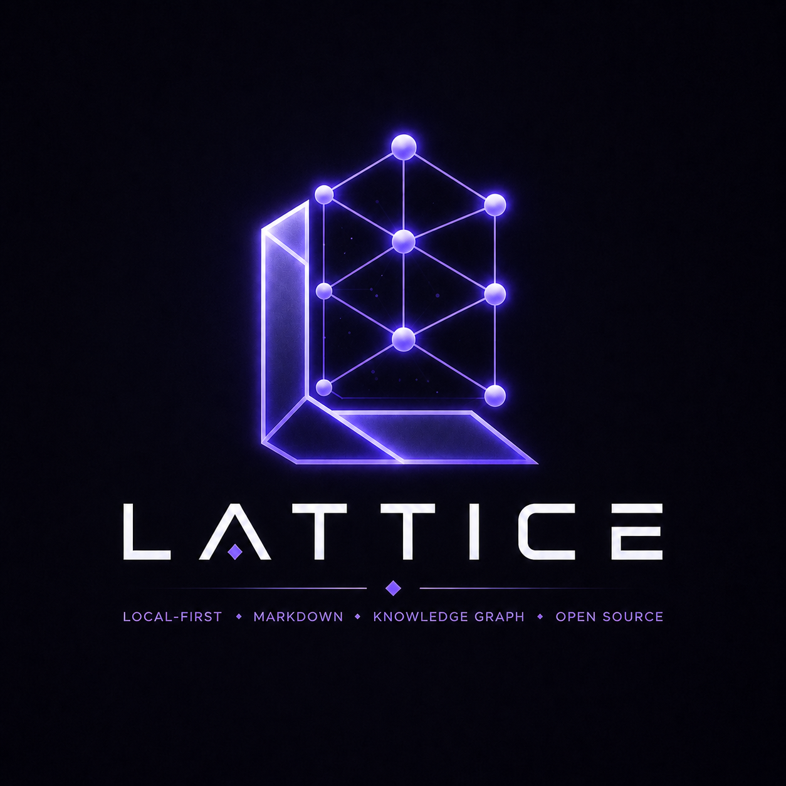

# LATTICE

<p align="center">
  
</p>

LATTICE is an open-source, local-first Markdown knowledge graph IDE. It keeps Markdown files as the source of truth, builds a rebuildable SQLite metadata cache, renders backlinks and graph relationships, and runs a permission-first Obsidian-compatible plugin system.

> Your files. Your graph. Your plugins. Your AI. No lock-in. No black box.

## Status

Version `0.1.0` — active development toward Obsidian feature parity. Core vault, editor, graph, search, bookmarks, hotkeys, canvas format, and plugin runtime are complete.

## Features

### Editor
- Create or open a local vault folder. First launch defaults to `Documents/Lattice Vault` unless `LATTICE_VAULT_PATH` is set.
- Import existing Markdown vaults — `.obsidian/` folder untouched.
- CodeMirror 6 source editor and TipTap WYSIWYG editor; toggle per-note.
- Code folding, fold gutter, find/replace panel (`Ctrl+F` / `Ctrl+H`), indentation guides.
- Wikilinks, Markdown links, image/file embeds, callouts, tags, frontmatter, headings, tasks, backlink extraction.
- Inline title: click to rename the active note in place.
- YAML Properties panel — typed fields (text, list, number, checkbox, date, datetime) rendered above the note body; per-note `cssclasses` applied to the editor pane.
- Spellcheck language selection, RTL mode, auto-pair brackets/Markdown delimiters, tab size, auto-convert HTML.

### Tabs & Workspace
- Multi-tab workspace: open, close, pin, and reorder tabs via drag or middle-click.
- Tab context menu: Close, Close Others, Close to Right, Pin/Unpin, Copy Path.
- Reopen last closed tab (`Ctrl+Shift+T`), close active tab (`Ctrl+W`).
- Named workspace snapshots: save and restore a full set of open tabs by name.

### File Explorer
- File tree with folder expand/collapse.
- Right-click context menu: Open in New Tab, New Note, New Folder, Rename, Duplicate, Move, Delete, Copy Path, Copy Obsidian URI, Add to Bookmarks.
- Configurable delete strategy (trash / system trash / permanent), rename link-rewriting toggle.
- Tag list in sidebar with quick-filter by clicking a tag.

### Search
- Persistent search panel in left sidebar (third tab).
- Sort by relevance, name, or modified date.
- Scoped query operators: `line:(text)`, `block:(text)`, `section:(text)`.
- Expand/collapse per-result context excerpts, copy all results as Markdown list.

### Bookmarks
- Bookmarks panel in left sidebar (second tab) with folder grouping.
- Supports five target kinds: note, heading, block, search query, folder.
- Search-filter, click to activate, delete from sidebar.

### Command Palette & Hotkeys
- Command palette (`Mod+K`) with fuzzy search across all registered commands.
- Custom hotkey editor in Settings → Keyboard: searchable table, click-to-record new binding, conflict highlighting, reset-to-defaults.
- Per-user bindings persisted across sessions; conflict detection highlights duplicate combos in amber.
- Default bindings: 20+ commands including `Mod+S` save, `Mod+N` new note, `Mod+G` graph, `Mod+,` settings.

### Core Plugins
- **Templates** — insert any note from a configurable templates folder.
- **Random note** — open a randomly selected note from the vault.
- **Unique note** — create a note with a Zettelkasten-style unique ID filename.
- **Daily note** — open today's daily note (`Mod+Shift+D`).
- **Bookmarks** — manage starred notes, headings, blocks, folders, and searches.
- **Page preview** — hover any wikilink to see a ~280 ms popup of the target note.
- **Format converter** — convert all wikilinks ↔ Markdown links across the vault in one command.

### Canvas
- Canvas-based luminous constellation graph renderer.
- Obsidian JSON Canvas schema support (`canvas-file.ts`): bidirectional conversion between Lattice and `.canvas` format for text, file, link, and group nodes with typed edges.

### Graph
- Full-vault backlink graph rendered on an interactive canvas.
- Node motion, hit detection, zoom/pan.

### Collections (Bases)
- Table and card views over Markdown files with YAML properties and cover image fields — equivalent to Obsidian Bases.

### AI Console
- Local CLI providers: Claude Code, Codex CLI, Gemini CLI, GitHub Copilot CLI, Ollama.

### Plugin Runtime
- Obsidian-compatible plugin runtime (worker-based, sandboxed).
- Typed permission model — plugins declare capabilities and users approve per-action.
- Plugin command registry with `addCommand`, `addRibbonIcon`, `addSettingTab` hooks.
- Plugin marketplace and permission modal UI.

### Settings
- **Editor**: default mode (source/preview/live), inline title, editor status bar, strict line breaks, fold heading/indent, indentation guides, RTL, spellcheck languages, auto-pair brackets/Markdown, auto-convert HTML, Vim mode.
- **Files**: new note location (vault root / Inbox / custom folder / same folder as active note), attachment deletion policy, detect all file extensions.
- **Appearance**: color scheme (dark/light/system), show/hide ribbon, tab title bar, view header.
- **Keyboard**: full hotkey editor (see above).

## Screenshots

Screenshots are intentionally left as placeholders until the desktop bundle is captured in CI.

## Tech Stack

- Tauri v2, Rust, SQLite, `notify`, `rusqlite`
- React 19, TypeScript, Vite, Tailwind CSS
- CodeMirror 6 (source editor), TipTap (WYSIWYG)
- Zustand (state), TanStack Query, Framer Motion
- Canvas renderer (graph and canvas views)

## Development Setup

Prerequisites:

- Node.js 22+
- pnpm 10+
- Rust stable toolchain with Cargo
- Tauri v2 system prerequisites for your platform

```bash
pnpm install
pnpm dev
```

On Windows:

```powershell
.\scripts\setup.ps1
.\scripts\dev.ps1
```

## Commands

```bash
pnpm dev            # Start Vite dev server at http://127.0.0.1:1420
pnpm desktop:web    # Frontend-only web build
pnpm desktop:dev    # Tauri dev (full desktop)
pnpm build          # Production build
pnpm test           # Vitest
pnpm lint           # ESLint
pnpm typecheck      # tsc --noEmit across all packages
cargo test --workspace
cargo fmt --all
cargo clippy --workspace --all-targets -- -D warnings
```

## Architecture

The desktop shell is React + TypeScript inside Tauri. Rust owns vault access, indexing, SQLite, search, graph generation, health reports, local asset reads, Collections queries, plugin registry state, and CLI provider execution. The frontend talks to Rust through typed Tauri commands.

Markdown files remain the only durable source of note content. `.lattice/index.db` is a cache and can be rebuilt from files at any time.

See [docs/architecture.md](docs/architecture.md) for details.

## Security

No telemetry enabled by default. Plugins are permissioned by design, AI providers are local-first, and external network access must be explicit. See [SECURITY.md](SECURITY.md).

## Contributing

See [CONTRIBUTING.md](CONTRIBUTING.md).
